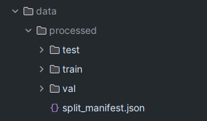
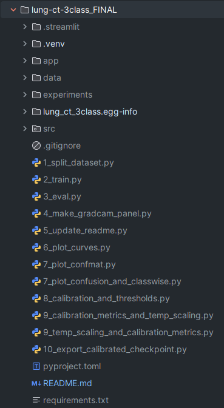
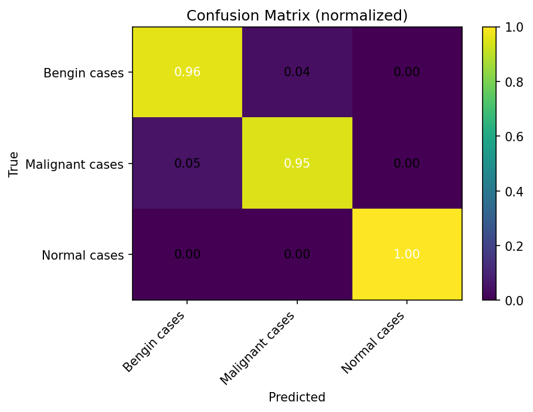
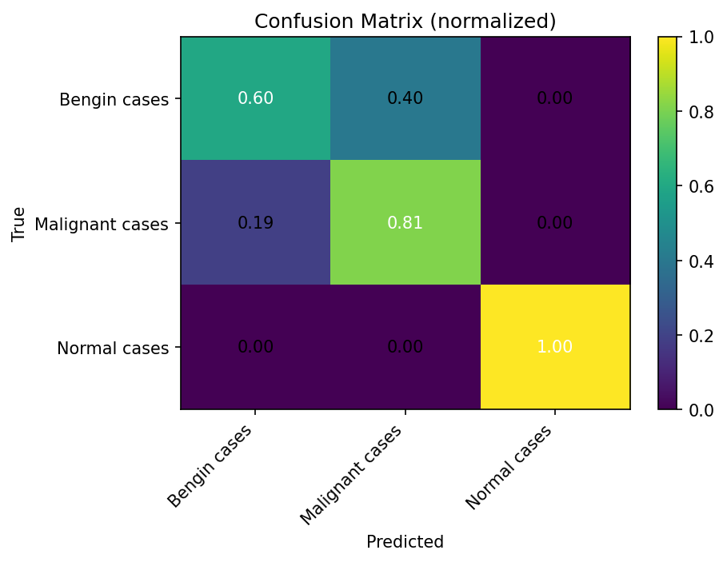

# Lung CT SCAN Classification (Normal / Benign / Malignant)

End‑to‑end pipeline to train, evaluate, **compare ResNet50 / ViT-B/16 / ResViT**, visualize **Grad-CAM**, and deploy with **Streamlit**.

 ⚠️ Research demo only — **not** for clinical use.

## 🗂️ Dataset

Expected layout under data/processed/:

Need splits from a single pool?
python src\1_split_dataset.py --src data\raw --dst data\processed --val 0.2 --test 0.2 --seed 42

## 📦 Project Layout (key folders)

## 🖼️ Figures (existing files under `figs/`)

> Links point to real files in your repo’s `experiments/expXX_*/figs/` folders.  
> These filenames follow your generated class names (e.g., **“Bengin cases”**).

### ✅ ResNet50 — `experiments/exp01_resnet/figs/`

**Confusion Matrix**  

**Precision-Recall**

**ROC**

**Calibration (Reliability)**

### ✅ ViT-B/16 — experiments/exp02_vit/figs/

**Confusion Matrix**  

**Precision-Recall**

**ROC**

**Calibration (Reliability)**

### ✅ ResViT — experiments/exp03_resvit/figs/

**Confusion Matrix**  

**Precision-Recall**

**ROC**

**Calibration (Reliability)**

## 🖥️ Streamlit App

Run:
conda activate torch_gpu
python -m streamlit run app\streamlit_app.py

- Single or 3‑model compare
- **ResViT** CAM toggle: CNN last conv ↔ ViT last block
- Download **Grad‑CAM overlays** as PNG
- Upload an evaluation.json`to auto‑detect trained class order

## 📜 License

MIT (add a LICENSE file if open‑sourcing).
